# ERD 설계 - Bookku

## 1. 개요

USER, BOOK을 중심으로 거래(POST), 리뷰(REVIEW), 커뮤니티(COMMUNITY), 채팅(CHAT), 알림(NOTIFICATION) 기능을 지원하는 스키마입니다.

- 좋아요(LIKE)와 댓글(COMMENT)은 대상 도메인별로 개별 테이블로 분리
- 알림(NOTIFICATION)은 여러 도메인의 이벤트를 하나의 피드로 통합 조회해야 하는 특성상 테이블 분리 없이 다형성(target_type + target_id) 구조 유지
- 커뮤니티와 거래글에 삽입되는 이미지는 대상 도메인별로 개별 테이블로 분리
- 채팅(CHAT)은 거래글 단위가 아닌 사용자 간 1:1 매칭이며, 거래글에서 채팅을 시작할 경우 메시지 내에서 카드로 공유

## 2. ERD

```mermaid
erDiagram
  USER ||--o{ POST : writes
  USER ||--o{ REVIEW : writes
  USER ||--o{ COMMUNITY : writes
  USER ||--o{ COMMUNITY_COMMENT : writes
  USER ||--o{ REVIEW_COMMENT : writes
  USER ||--o{ POST_LIKE : gives
  USER ||--o{ REVIEW_LIKE : gives
  USER ||--o{ COMMUNITY_LIKE : gives
  USER ||--o{ COMMUNITY_COMMENT_LIKE : gives
  USER ||--o{ REVIEW_COMMENT_LIKE : gives
  USER ||--o{ SUBSCRIBE : "follows (as follower)"
  USER ||--o{ SUBSCRIBE : "is followed (as following)"
  USER ||--o{ CHAT_ROOM : "participates as A"
  USER ||--o{ CHAT_ROOM : "participates as B"
  USER ||--o{ CHAT_MESSAGE : sends
  USER ||--o{ NOTIFICATION : "receives (as recipient)"
  USER ||--o{ NOTIFICATION : "triggers (as actor)"
  BOOK ||--o{ REVIEW : "reviewed in"
  BOOK ||--o{ POST : "listed in"
  POST ||--o{ POST_LIKE : "liked by"
  POST ||--o{ POST_IMAGE : has
  REVIEW ||--o{ REVIEW_LIKE : "liked by"
  REVIEW ||--o{ REVIEW_COMMENT : has
  REVIEW_COMMENT ||--o{ REVIEW_COMMENT : "replies to"
  REVIEW_COMMENT ||--o{ REVIEW_COMMENT_LIKE : "liked by"
  COMMUNITY ||--o{ COMMUNITY_LIKE : "liked by"
  COMMUNITY ||--o{ COMMUNITY_COMMENT : has
  COMMUNITY ||--o{ COMMUNITY_IMAGE : has
  COMMUNITY_COMMENT ||--o{ COMMUNITY_COMMENT_LIKE : "liked by"
  COMMUNITY_COMMENT ||--o{ COMMUNITY_COMMENT : "replies to"
  CHAT_ROOM ||--o{ CHAT_MESSAGE : contains

  USER {
    int id PK
    uuid uuid UK "외부 노출용 식별자"
    string username UK
    string email UK
    string password
    string nickname
    string bio
    string profile_image_url
    timestamp created_at
    timestamp updated_at
  }

  BOOK {
    int id PK
    string isbn UK
    string title
    string author
    string publisher
    string cover_image_url
    int original_price "정가, nullable"
    text description "출판사 제공 책소개"
    string external_source "도서 검색 API 제공자"
    string external_id "API가 제공하는 도서 ID"
    timestamp created_at
    timestamp updated_at
  }

  REVIEW {
    int id PK
    int book_id FK
    int user_id FK
    uuid uuid UK "외부 노출용 식별자"
    string title
    text content
    decimal rating "0에서 5까지 0.5 단위 지원"
    timestamp created_at
    timestamp updated_at
  }

  POST {
    int id PK
    string post_type "SALE / PURCHASE"
    int book_id FK
    int user_id FK
    uuid uuid UK "외부 노출용 식별자"
    text content
    int price "판매글에만 사용"
    string book_condition "HIGH / MEDIUM / LOW"
    string trade_status "SELLING / RESERVED / SOLD_OUT"
    timestamp created_at
    timestamp updated_at
  }

  CHAT_ROOM {
    int id PK
    string external_room_id UK "외부 API 발급 ID"
    int user_a_id FK
    int user_b_id FK
    timestamp created_at
  }

  CHAT_MESSAGE {
    int id PK
    int room_id FK
    int sender_id FK
    text content
    string message_type "TEXT / IMAGE / SHARE_CARD"
    string linked_target_type "POST / REVIEW / COMMUNITY 등, nullable"
    int linked_target_id "nullable"
    boolean is_read "수신자 읽음 여부"
    timestamp sent_at
  }

  COMMUNITY {
    int id PK
    int user_id FK
    uuid uuid UK "외부 노출용 식별자"
    string content
    string linked_target_type "POST / REVIEW / COMMUNITY 등, nullable"
    int linked_target_id "nullable"
    timestamp created_at
  }

  COMMUNITY_COMMENT {
    int id PK
    int community_id FK
    int user_id FK
    text content
    int parent_comment_id FK "대댓글의 원댓글의, nullable"
    timestamp created_at
    timestamp updated_at
  }

  REVIEW_COMMENT {
    int id PK
    int review_id FK
    int user_id FK
    text content
    int parent_comment_id FK "대댓글의 원댓글 ID, nullable"
    timestamp created_at
    timestamp updated_at
  }

  POST_LIKE {
    int id PK
    int user_id FK
    int post_id FK
    timestamp created_at
  }

  REVIEW_LIKE {
    int id PK
    int user_id FK
    int review_id FK
    timestamp created_at
  }

  COMMUNITY_LIKE {
    int id PK
    int user_id FK
    int community_id FK
    timestamp created_at
  }

  COMMUNITY_COMMENT_LIKE {
    int id PK
    int user_id FK
    int community_comment_id FK
    timestamp created_at
  }

  REVIEW_COMMENT_LIKE {
    int id PK
    int user_id FK
    int review_comment_id FK
    timestamp created_at
  }

  POST_IMAGE {
    int id PK
    int post_id FK
    string image_url
    int display_order
  }

  COMMUNITY_IMAGE {
    int id PK
    int community_id FK
    string image_url
    int display_order
  }

  SUBSCRIBE {
    int id PK
    int follower_id FK
    int following_id FK
    timestamp created_at
  }

  NOTIFICATION {
    int id PK
    int recipient_id FK "수신자"
    int actor_id FK "행위자(좋아요 누른 사람 등), nullable"
    string notification_type "POST_LIKE / NEW_COMMENT / NEW_FOLLOWER 등"
    string target_type "POST / REVIEW / COMMUNITY 등, nullable"
    int target_id "nullable"
    string preview_text "알림 문구 스냅샷"
    boolean is_read
    timestamp created_at
  }
```

## 3. 제약조건

| 테이블 | 제약조건 | 설명 |
|---|---|---|
| REVIEW | `UNIQUE(user_id, book_id)` | 하나의 도서에 중복 리뷰 작성 방지 |
| CHAT_ROOM | `UNIQUE(user_a_id, user_b_id)` | 두 사용자 간 중복 채팅방 방지 |
| POST_LIKE | `UNIQUE(user_id, post_id)` | 거래글에 중복 좋아요 방지 |
| REVIEW_LIKE | `UNIQUE(user_id, review_id)` | 리뷰에 중복 좋아요 방지 |
| COMMUNITY_LIKE | `UNIQUE(user_id, community_id)` | 커뮤니티글에 중복 좋아요 방지 |
| COMMUNITY_COMMENT_LIKE | `UNIQUE(user_id, community_comment_id)` | 커뮤니티 댓글에 중복 좋아요 방지 |
| REVIEW_COMMENT_LIKE | `UNIQUE(user_id, review_comment_id)` | 리뷰 댓글에 중복 좋아요 방지 |
| SUBSCRIBE | `UNIQUE(follower_id, following_id)` | 중복 구독 방지 |
| SUBSCRIBE | `CHECK(follower_id != following_id)` | 자기 자신 구독 방지 |

## 4. 구현 시 주의사항

- POST의 price는 BOOK의 original_price를 초과할 수 없음
  - DB 레벨에서는 제약조건 설정이 불가하므로, 애플리케이션 구현 시 반영
- CHAT_ROOM의 제약조건 UNIQUE(user_a_id, user_b_id) 구현
  - MySQL에서는 UNIQUE(A, B)의 값들을 집합이 아닌 순서가 있는 튜플로 비교하기 때문에, 두 ID 중 작은 값을 항상 A에 넣는 애플리케이션 로직 필요

## 5. 설계 노트

- **LIKE/COMMENT를 개별 테이블로 분리한 이유**
  - JPA 정규 매핑 방식 `@OneToMany` 활용 가능
  - 관련 정보(작성자, 내용 등)가 항상 최신 정보를 반영해야 하기 때문에 원본 테이블과의 JOIN이 잦음
  - 좋아요/댓글 대상 도메인이 POST/REVIEW/COMMUNITY/COMMENT로 고정적 (확장 가능성 낮음)
  - 좋아요 누른 대상/댓글 단 대상 조회 기능은 도메인 별로 제공하기에 도메인 통합 조회 필요성 없음
- **NOTIFICATION을 다형성 구조로 유지한 이유**
  - 알림함은 여러 도메인 이벤트(POST, COMMENT, REVIEW_LIKE, SUBSCRIBE ...)를 하나의 시간순 피드로 "통합 조회"하는 것이 목적
  - 알림 조회시 스냅샷(preview_text)을 사용해 원본 테이블을 조회할 필요가 없기 때문에 JOIN이 불필요
  - 알림 대상 도메인 확장 가능성 높음